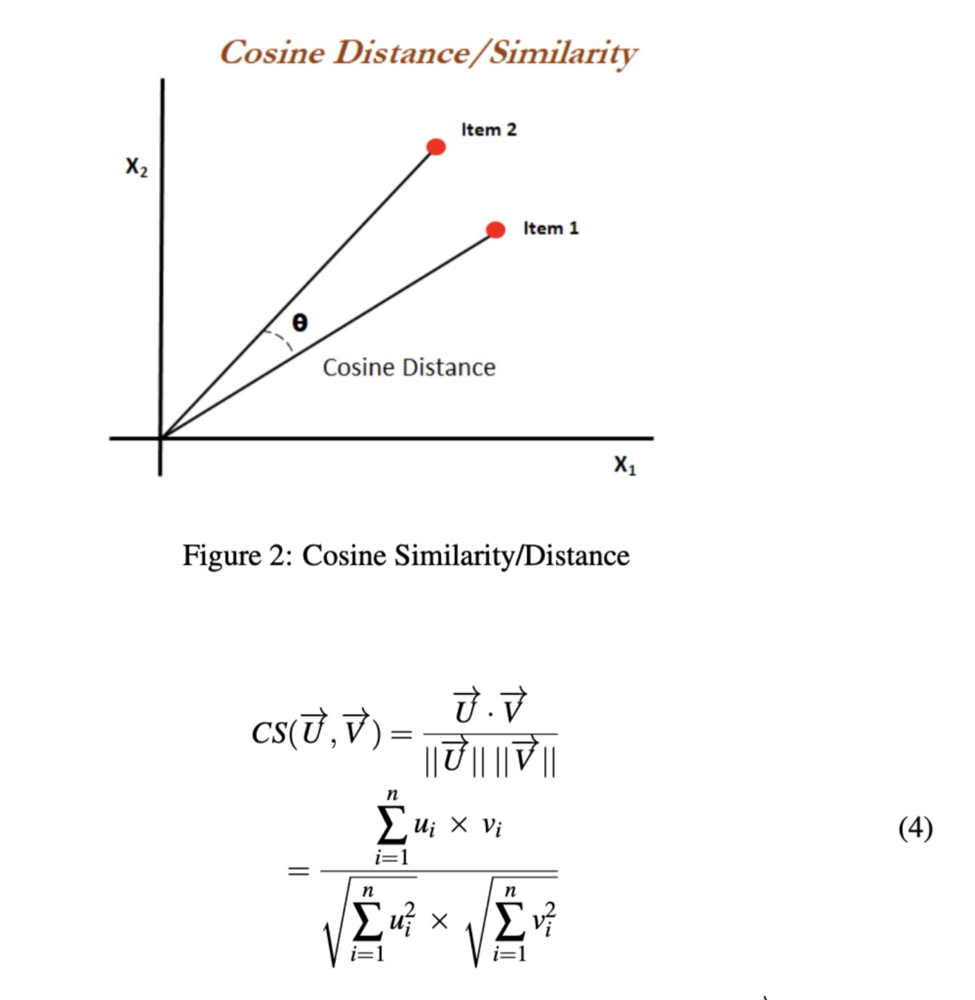
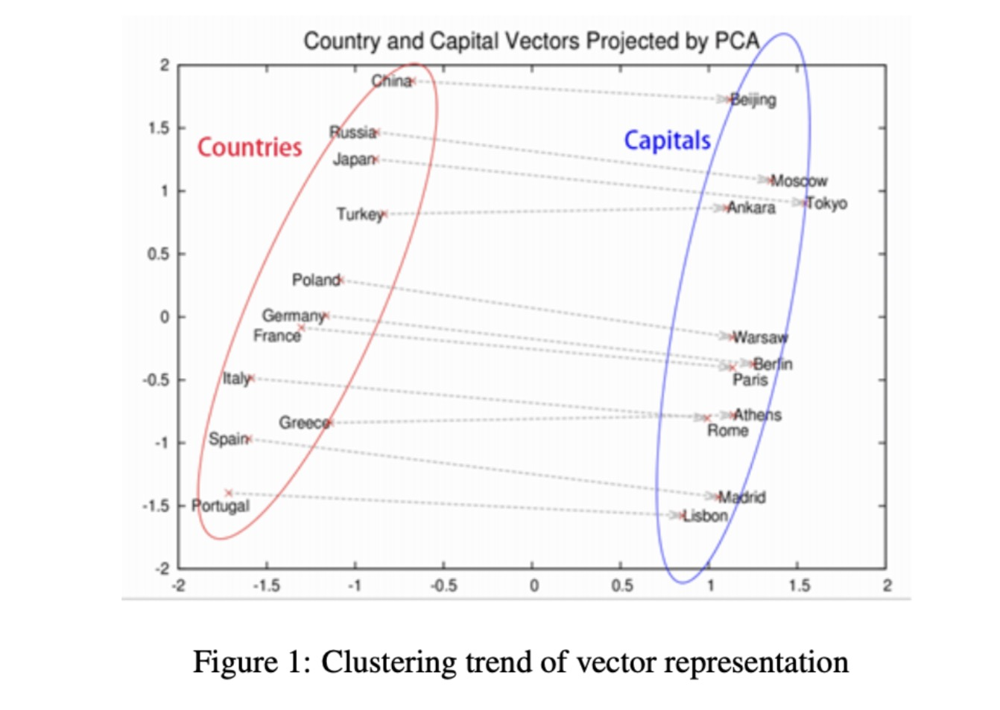

# News Article Classifier Using TF-IDF

> A Java-based classifier that categorises news articles based on their semantic content using the Term Frequency-Inverse Document Frequency (TF-IDF) embedding technique combined with cosine similarity, written for an Object-Oriented programming assignment at the University of Birmingham.

---

## Description

This project constructs a classifier that can categorise news articles based on their content. It was tested using a dataset consisting of 20 news articles sourced from the Sky News website (included in the `resources/` folder).

These articles can be broadly classified into two distinct categories, each representing a different topic. For example:
- **Category 1**: Science & Space  
  - e.g., *"Osiris-Rex’s sample from asteroid Bennu will reveal secrets of our solar system"*
- **Category 2**: Finance & Cryptocurrency  
  - e.g., *"Bitcoin slides to five-month low amid wider sell-off"*

The main goal was to assess the **semantic closeness** of these 20 news articles using **TF-IDF embedding** and group them accordingly. Articles within the same topic should appear closer in vector space than those from a different category.

---

## TF-IDF Embedding

### What is TF-IDF?
TF-IDF stands for **Term Frequency-Inverse Document Frequency**. It's a statistical measure that evaluates how relevant a word is to a document in a collection (corpus).

It transforms a text document into a **high-dimensional numerical vector**, where each dimension corresponds to a word in the vocabulary, and the value is the TF-IDF weight of that word.

### Why use TF-IDF?
Unlike simpler techniques such as one-hot encoding (which assigns a fixed ID to each word), TF-IDF assigns **weights** based on the importance of each word in its context:
- Common words across many documents are weighted down.
- Rare words that are significant to specific documents are weighted up.

---

## TF-IDF Calculation

### 1. Term Frequency (TF)
Measures how frequently a word occurs in a document:
```
TF(t, d) = ft,d / ∑t'∈d ft',d
```
Where:
- `ft,d` is the number of times term `t` appears in document `d`
- The denominator is the total number of terms in the document

### 2. Inverse Document Frequency (IDF)
Measures how rare or unique a word is across all documents:
```
IDF(t, D) = log(N / (|{d ∈ D : t ∈ d}| + 1))
```
Where:
- `N` is the total number of documents
- `|{d ∈ D : t ∈ d}|` is the number of documents containing term `t`

### 3. TF-IDF Score
```
TF-IDF(t, d) = TF(t, d) * IDF(t, D)
```

## Cosine Similarity

To assess semantic similarity between articles, **cosine similarity** is computed between their TF-IDF vectors. It measures the angle between two vectors in high-dimensional space.



---

## Clustering

Once pairwise similarities are computed, you can use clustering methods (e.g., K-Means or hierarchical clustering) to group similar articles. Figure [1]:



---

## Testing

A test file is included in the source code to verify the functionality of the classifier, along with the dataset consisting of 20 news articles from the Sky News website. This dataset can be replaced to perform semantic analysis on a different collection of documents.

---

## References

[1] T. Mikolov, I. Sutskever, and L. L. Quoc, “Learning the meaning behind
words,” Google Open Source Blog, 2016. [Online]. Available: https://opensource.googleblog.com/2013/08/learning-meaning-behind-words.html

## License

This project was developed as coursework for academic purposes.
